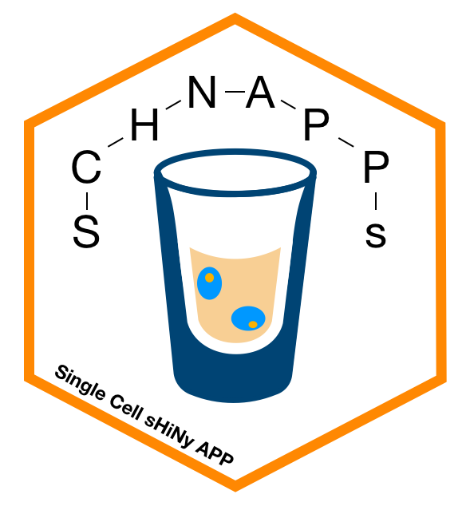

# SCHNAPPs - Single Cell sHiNy APP(s)

## Overview

Shiny app for the exploration and analysis of single cell RNAseq data as it comes from 10X or MARSseq technologies. It is currently being developed based on user requests of the Cytometry and Biomarkers UTechS at the Pasteur Institute, Paris. The goal is to enable the users of our platform to explore their data, select cells they would like to work with and then perform the final analysis together with the bioinformatics support at Pasteur.


## Installation

```
if (!require("devtools"))
  install.packages("devtools")
devtools::install_github("mul118/shinyMCE")
if (!requireNamespace("BiocManager", quietly = TRUE))
    install.packages("BiocManager")
BiocManager::install("BiocSingular")
install_github("C3BI-pasteur-fr/UTechSCB-SCHNAPPs")
```

## Running schnapps

To start the app:

```
library(SCHNAPPs)
schnapps()
```

### load data

A singleCellExperiment object is required, saved in a file RData object using 

```
save(file = "filename.RData", "singleCellExperiementObject")
```

Load a small set of 200 cells and save to a file in the local directory

```
data("scEx", package = "SCHNAPPs")
save(file = "scEx.Rdata", list = "scEx")
```

## Screen-shots / walk-through

Under the following link you can find some [screen-shots](www/screen_shots.md)


## FAQ

The FAQ answers question on how specific questions can be handled witht SCHNAPPs.

[FAQ](www/faq.md)


## Extending SCHAPPs

See [SCHNAPPsContribution](https://github.com/baj12/SCHNAPPsContributions) for examples and dummy contributions on how add functionality.

## Credits

The original version of this app is based on CellView (https://github.com/mohanbolisetty/CellView), but it was substantially modified. It helped me get started.

We are also greatful to all the members of the single cell working group at Pasteur Paris.