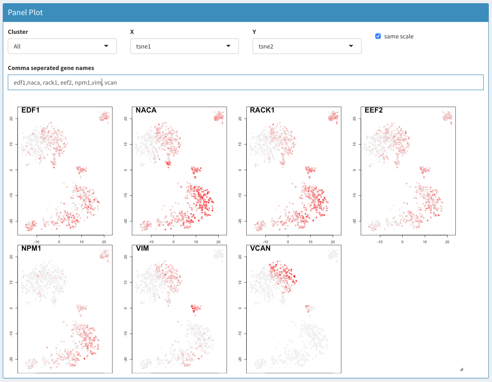
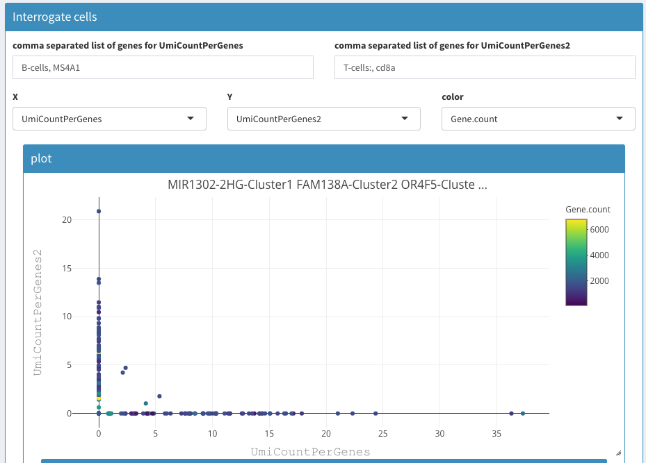

```{r, include = FALSE}
knitr::opts_chunk$set(
  collapse = TRUE,
  comment = "#>"
)
```

```{r setup, include=FALSE}
library(SCHNAPPs)
library("htmltools")
library("vembedr")

```

## Scientific questions

### Identify Dead cells

Dead cells can have high mitochondrial or ribosomal protein content. Using SCHNAPPs those can be identified before and after removing of such genes from the data set. Though they have to be present in the original input data set.

#### before removing genes

```{r, out.width='90%', fig.align='center', fig.cap='Set before-Filter variable', echo=FALSE}
knitr::include_graphics('images/beforeFilter.png')
```

The regular expression in the image above is used to count UMIs in the original non-normalized data before any filters are applied. Then we have this count for the cells that have not been removed and can use this in a 2D plot:

```{r, out.width='90%', fig.align='center', fig.cap='Before filter applied', echo=FALSE}

```

Here, we show the UMI count on the x-axis and the before filter on the y-axis. We also devide the UMI count by the before filter column, which emphasises the effect and allows us to clearly identify dying cells. In this case the dying cells fall into clusters 1, 2, and 3. So we can select those clusters and copy/paste the cells in the "cells to be removed field".


```{r, out.width='90%', fig.align='center', fig.cap='Select cells for copy/paste', echo=FALSE}
knitr::include_graphics('images/beforeFilterCellSelect.png')
```

```{r, out.width='90%', fig.align='center', fig.cap='remove cells', echo=FALSE}
knitr::include_graphics('images/beforeFilterCellsRM.png')
```

Don't forget to click on apply changes!

### Identify cells from violin plot

The cells in the violin plot are not selectable (for the moment). In order to identify those cells one has to use the 2D plotting function, preferably under Co-expression - Selected

### Can MARS-Seq data be analyzed?

Yes, additional annotations can be either directly into a singlecellexperiment object that is loaded in the app as colData, or using a CSV file with corresponding information. 

Use 

> colData(scEx) <- myAdditionalInformation 

to set the relevant information.


### How to normalize by ribosomal proteins?

Once you have identified the gene names you want to use this list of genes can be used under Parameters - Normalization - gene_norm: 

```{r, out.width='90%', fig.align='center', fig.cap='normalize by ribosomal proteins', echo=FALSE}
knitr::include_graphics('images/normByRP.png')
```

You can get this list by temporarily setting the regular expression for selection of genes to be removed. Then click apply changes.

```{r, out.width='90%', fig.align='center', fig.cap='regular expression for selecting ribosomal/mitochondrial genes', echo=FALSE}

```

Then, in the lower area of the same screen the genes that have been removed are shown:

```{r, out.width='90%', fig.align='center', fig.cap='table of removed genes', echo=FALSE}

```


### What is the best representation to use to compare gene expression level ( UMI/gene) ? 

Gene/UMI expression can be visualized in different plots:

* The <b>panel plot</b> gives an overview of which cells express different genes projected in 2 dimensions. The dimensions can be chosen freely. This allows for a general overview of the regions in the PCA/tSNE/UMAP space where differences are expressed. It can be difficult to compare the expression of individual cells.

```{r, out.width='90%', fig.align='center', fig.cap='Panel plot', echo=FALSE}

```

* Using the parameters UmiCountPerGenes and UmiCountPerGenes2 allow plotting the expression of one or more genes (i.e. the sum of all UMIs) that are set with these variables. These two parameters can be found under X/Y when selecting the projections to be used for the X/Y axes. With these parameters, the expression of two sets of genes can be compared and the information of individual cells can be retained. Zooming and coloring allows drilling down and identifying individual cells. Using “more options” these can then be annotated. Following such annotation, this information can be used in other plots as a projection. Those projections are currently binary, i.e. have the values False and True or 0 and 1, indicating if a cell belongs to a group or not.

The figure below shows the combined expression of marker genes for B and T cells in an PBMC experiment. Note that the first gene name is B-cells:, This will allow you to annotate the selection. It will give rise to a warning, but that will disappear after a few seconds.

```{r, out.width='90%', fig.align='center', fig.cap='2D plot CD8 vs CD4 cell expression', echo=FALSE}

```


### How to evaluate if the clusters are biologically relevant?


```{r, echo=FALSE}
embed_youtube("kL00ceA51vs")
```


### How to identify cells in a cluster of a Tsne plot and list them ? 

Using the 2D plot, select tsne1 and tsne2. Using the mouse select the cells of interest. Check "more options", then check "show cell names".

```{r, out.width='90%', fig.align='center', fig.cap='selecting cells', echo=FALSE}
knitr::include_graphics('images/CellSelection2.png')
```

<!----
### What are the different heat maps that can be generated and how many genes could be listed  by cluster ?

Cells in the cluster can be selected on the 2D plot and cell names are shown after checking “show more options” followed by checking “show cell names”; 

---->

### What is the best representation to use to compare gene expression level

Gene/UMI expression can be visualized in different plots:

The <b>panel plot</b> gives an overview which cells express different genes projected in 2 dimensions. The dimensions can be chosen freely. This allows for a general overview of the regions in the PCA/tSNE/UMAP space where differences are expressed. It can be difficult to compare the expression of individual cells.


Using <b>2D plots</b>, the parameters UmiCountPerGenes and UmiCountPerGenes2 allow plotting the expression of one or more genes (i.e. the sum of all UMIs) that are set with these variables. These two parameters can be found under X/Y when selecting the projections to be used for the X/Y axes. With these parameters, the expression of two sets of genes can be compared and the information of individual cells can be retained. Zooming and coloring allows drilling down and identifying individual cells. Using “more options” these can then be annotated. Following such annotation, this information can be used in other plots as a projection. Those projections are currently binary, i.e. have the values False and True or 0 and 1, indicating if a cell belongs to a group or not.

### Can the analysis be performed on a subset of selected cells and how?

Analysis can be narrowed to a selection of cells copying cell names in the tab  “Cell selection - Cells to keep, remove others”. The number of cells will be updated in the summary statistics on the sidebar and clicking on  “apply changes”  will apply cell selection. 

<!----
### How to identify signature genes with same distribution as a given marker gene? 

--->

### What are the possible trajectory inferences approaches  that could be used ?

Contributions for trajectory inference already available are SCORPIUS, ElPiGraph.R, and DCA (see GitHub)[https://github.com/baj12/SCHNAPPsContributions]

<!----

### To display a developmental pathway according to time of expression of genes from an input involving several datasets ?


### To display a biological  process from a single dataset ?
--->

### Can new packages be implemented ?

The software architecture  of the application makes it easy for the bioinformatician to integrate new visualizations and analyses. 
please see https://github.com/baj12/SCHNAPPsContributions 


## Common problems

### Nothing happens!!!!!

Patience, please. There are quite a few occasions when the user has to wait. Specifically, when opening the app on a fresh start. There are some 100 packages or so to be loaded. This takes time.

Other places that take long waiting times are after loading data (then most calculations will be initialized), changing the parameters for normalization, PCA, ... (everything that touches the normalized data and projections). 

UMAP is notoriously slow, that is why there is to check box to activate it.

Please see if the processors on your computer related to R are active, this usually means that you should wait.

There is no clean way stopping a running task other than killing it.

Reports take even longer. Wait times of an hour or more are not uncommon. Then after a screen for saving the file appears and Ok is pressed the same time will be used again to redo the report. I haven't found a way yet to overcome this. Any ideas are welcome.

### New windows pop up

When saving files or generating a report Shiny opens a new window and doesn't close it. You can safely close it after the operation is completed.


