```{r, include = FALSE}

# generate using 
# pkgdown::build_site()

knitr::opts_chunk$set(
  collapse = TRUE,
  comment = "#>"
)
```

```{r setup, include=FALSE}
library(SCHNAPPs)
```


# Overview

Shiny app (referred to as "app" in this document) for the exploration and analysis of single cell RNAseq data as it comes from 10X or MARSseq technologies or other. It is currently being developed based on user requests of the Cytometry and Biomarkers UTechS at the Institut Pasteur, Paris. The goal is to enable the users of our platform to explore their data, select cells they would like to work with and then perform the final analysis together with the bioinformatics support at Pasteur. We hope you might find it helpful as well.


# Installation

```
if (!require("devtools"))
  install.packages("devtools")
devtools::install_github("mul118/shinyMCE")
if (!requireNamespace("BiocManager", quietly = TRUE))
    install.packages("BiocManager")
BiocManager::install("BiocSingular")
devtools::install_github("C3BI-pasteur-fr/UTechSCB-SCHNAPPs")
```


## history functionality

To take advantage of the history functionality orca needs to be installed:
(https://github.com/plotly/orca#installation)

orca is part of ploty so nothing to be done for R. But the pdftools are required:

```
install.packages("pdftools")
```

Notes:

If the historyPath variable is set to a valid directory, all major events are stored in an Rmd file and associated RData files that all located in subdirectory of the historyPath. A time-stamp in the name of the subdirectory enables identifying and distinguishing different executions. It is recommended to rename these directories once the session is closed. Major events are: 1. loading of data, change of cells/genes and projections.
In addition to these events that are automatically stored, the user can save individual tables and graphs using the appropiate buttons. During the execution of the app the Rmd file is only opened and appened to if an event is handled. Thus, using an editor that doesn't loc the file the Rmd can be modified at the same time the app is running. Just make sure you save the Rmd file each time a modification is done. A good editor is the RStudio editor.

# Running schnapps


The application is started from the command line in R using schnapps().

```
library(SCHNAPPs)
# create example data
save(file = "filename.RData", "singleCellExperiementObject")
# use "filename.RData" with load data functionality within the shiny app
schnapps()
```

Optional parameters:

* localContributionDir

    Additional functionally can be added using a vector with the paths to the contributions directories. See for example: (https://github.com/baj12/scShinyHubContributionsBJ)

* defaultValueSingleGene

    Some of the UI elements expect a single gene as input. This parameter can be preset with this value.

* defaultValueMultiGenes

    Some of the UI elements expect multiple genes as input. This parameter can be preset with this value.

* defaultValueRegExGene

    Default parameters for the regular expression used in the Gene selection tab (defaults to ^MT-|^RP|^MRP

* DEBUG

    If set to TRUE, debugging information will be displayed on the console

* DEBUGSAVE

    If set to TRUE, intermediate file will be written to disc. This delays calculation. It also creates a directory in the home folder called SCHNAPPsDEBUG, where all saved files are stored.

* historyPath

    location (directory) where history directories and data will be stored.


## Load data {#loadData}

To load count data there are two formats that are accepted: 

* singleCellExperiment object (preferred)
* CSV file with genes per row and cells as columns.
https://open.spotify.com/track/0POuQCMT4zyRzB2MjbzVaI
In addition, cell or gene metadata can be loaded from a CSV file (optional)

To save a singleCellExperiment object in an RData file use:

```
save(file = "filename.RData", "singleCellExperiementObject")
```

An example data set is provided with the package. Load a small set of 200 cells and save to a file in the local directory:

```
data("scEx", package = "SCHNAPPs")
save(file = "scEx.Rdata", list = "scEx")
```

This file can be loaded once the app is started.

# Overview of functionality

Below is the description of the individual tabs/views with the SCHNAPPs application.
^[ During the execution of a task, a message is displayed at the lower right corner. While the message is displayed other requests will wait. Though all mouse clicks and keyboard are normally retained (depending on the OS and computer characteristics), it is recommended to wait until the messages disappeared. Some internal SHINY processes that are not part of the actually SCHNAPPs application might also take considerable time. This can be checked using a monitoring tool (MAC: Activity Monitor).]


```{r, out.width='90%', fig.align='center', fig.cap='Overview, showing entry screen', echo=FALSE}
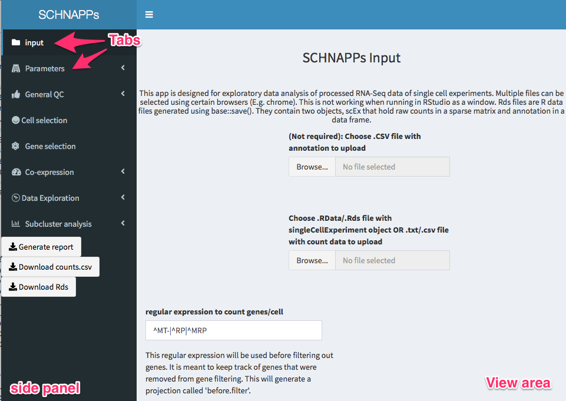
```

# Side panel

* Tabs: input, Parameters, Cell selection, Gene selection

    See below.

* Summary statistics of this dataset

    The name of the input files are listed, number of cells that are actively used (not necessarily the input data, but after applying the filters), number of genes with more than one UMI over all cells, median UMIs per cell, median number of genes with more than 1 UMI per cell, total number of UMIs (reads), memory used (just a very rough estimate at the beginning of the calculations), normalization method selected in parameters.


* Download counts.csv

    Download the normalized data as a CSV file.

* Download Rdata

    Download an RData file with the scEx object that can be reloaded in SCHNAPPs or other applications (e.g. iSEE).

* (Save for DEBUG)

    Only displayed when DEBUG is set to TRUE during start-up. Can be selected to save internal data for debugging purposes. This delays calculation. It also creates a directory in the home folder called SCHNAPPsDEBUG, where all saved files are stored.
    
* add to history

    allows adding a comment to the history .Rmd file.
    
* bookmark

    generates a bookmark that can be used to return to a state of the analysis.

```{r, out.width='90%', fig.align='center', fig.cap='While loading data', echo=FALSE}
#TODO remove report button + add comment to history + bookmark
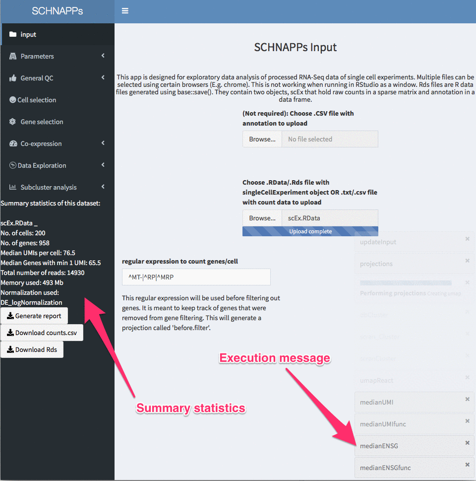
```

# Tabs

## Input

* Count data upload

    Load RData file with singleCellExperiment object or a CSV file. Only the count matrix and the rowData/colData are used as the transformations and projections will be recalculated based on the actual cells used. An example for the RData file is scEx.RData. To create the data locally follow the instructs under ["Load data"](#loadData). The SingleCellExperiment object has to contain a sampleNames column in the ColData slot. RowData should contain columns called symbol, Description, and id. Multiple RData files can be loaded.

PleaseNote ^[Since internally we call the singleCellExperiment object scEx, we first search for this name in the RData file. Otherwise the first SingleCellExperiment object is taken. For simplicity it is strongly recommended to have only one SingleCellExperiment in the RData file. <br/>
If only the "logcounts" slot is availbale it is taken as the "counts" slot since we require the "counts" slot. This also allows loading only transformed data. <br/>
When loading multiple RData files, it is strongly recommended not to use only logcount data as this hasn't been tested well enough.]

* Annotations to add

    Load annotation for cells and/or genes

    Examples for such files are given in :scExGenes.csv (gene annotations), scExCells.csv (cell annotations). Also the output from scorpius (see contributions) could be used here.

* input options

  * sub sample

    allows subsampling the input data to a random set of cells (the number can be chosen)
      
  * compute normalization

    Here we can choose if the normalization and transformation should be perfromed using SCHNAPPs (calculate normalization here), should be takeing from the loaded RData file (the singleCellExperiment object contains the log_)

* regular expression to count genes/cell

    This is a regular expression that is used to calculate a projection called “before.filter”. These counts are based on the original input data. A common use case would be to include here ribosomal/mitochondrial proteins and use this in a 2D plot together with UMI counts to visualize dying cells.

## Parameters

### Normalization

```{r, out.width='90%', fig.align='center', fig.cap='Parameters - Normalization', echo=FALSE}
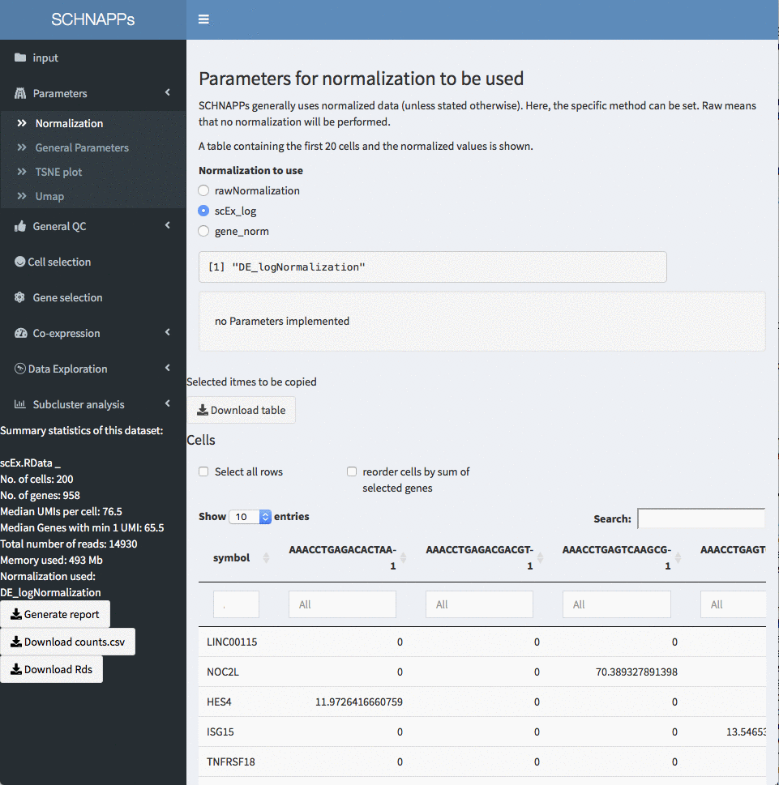
```

* rawNormalization:

    Umi counts, no transformation performed. Counts will still end up in the log-transformed slot

* scEx-Log

    Normalize by the total number of UMIs, log2(x+1) transform, scale with factor 1000

* scaterNorm

    uses scran::computeSumFactors followed by SingleCellExperiment::normalize
    
    Source ^[ scaterNorm: <br/>
    ```ta = table(sampinfo)```<br/>
  ```ta = ta[ta>0]```<br/>
  ```mtab = min(ta)```<br/>
  ```stp = round((mtab - 21) /10)```<br/>
  ```scaterReads <- scran::computeSumFactors(scEx, sizes = seq(21, mtab, stp),clusters = sampinfo,subset.row = genes2use)```<br/>
  ```scaterReads <- SingleCellExperiment::normalize(scaterReads)```]

* gene_norm

    Divide each expression by the sum of the genes supplied per cell. If no genes supplied then it is the same as scEx-log

    Additional parameters for a normalization from a contribution will be shown here as well. Since the standard normalizations don’t have any, none is shown.
    
    Source ^[gene_norm:<br/>
    ```nenner <- Matrix::colSums(assays(scEx)[[1]][genesin, , drop = FALSE])```<br/>
  ```nenner[nenner == 0] <- 1```<br/>
  ```A@x <- A@x / (nenner[A@j + 1L])```<br/>
  ```scEx_bcnorm <- SingleCellExperiment(assay = list(logcounts = as(A, "dgTMatrix")),colData = colData(scEx),rowData = rowData(scEx)```<br/>)
  ```x <- uniqTsparse(assays(scEx_bcnorm)[[1]])```<br/>
  ```slot(x, "x") <- log(1 + slot(x, "x"), base = 2) * scalingFactor```
]

* SeuratLogNorm

    Uses Seurat::NormalizeData function
    
* SeuratStandard

    Follows the standard Seurat protocol
    
    * Number of dimensions to use
    
    * number of features to use for anchor finding
    
    * number of neighbors (k)
    ^[test:<br/>
    `hello
    foo
    `]
    * number of neighbors when weighting
    
    Source ^[ SeuratStandard:<br/>
    ```seur.list <- SplitObject(seurDat, split.by = "sampleNames")```<br/>
    ```  for (i in 1:length(seur.list)) {```<br/>
    ```    seur.list[[i]] <- NormalizeData(seur.list[[i]])```<br/>
    ```    seur.list[[i]] <- FindVariableFeatures(seur.list[[i]], selection.method = "vst", nfeatures = 2000)```<br/>
    ```  }```<br/>
    ```  anchors <- FindIntegrationAnchors(object.list = seur.list, dims = 1:dims, anchor.features = anchorsF, k.filter = kF)```<br/>
    ```  integrated <- IntegrateData(anchorset = anchors, dims = 1:dims, k.weight = k.weight```<br/>
    ```  DefaultAssay(integrated) <- "integrated"```<br/>
    ```result <- ScaleData(integrated)```
      ]
    
* SeuratSCtransform

    * number of features to use for anchor finding
    
    * number of neighbors (k)
    
    * scaling factor
    
    * comma separated list of genes
   
    Source ^[ SeuratSCtransform:<br/>
    ```seur.list <- SplitObject(seurDat, split.by = "sampleNames")```<br/>
    ```  for (i in 1:length(seur.list)) {```<br/>
    ```    seur.list[[i]] <- SCTransform(seur.list[[i]])```<br/>
    ```  }```<br/>
    ```  features <- SelectIntegrationFeatures(object.list = seur.list, nfeatures = nfeatures)```<br/>
          ```  keep.features = keep.features[keep.features %in% rownames(scEx)]```<br/>
      ```  features = unique(c(features, keep.features))```<br/>
      ```  seur.list <- PrepSCTIntegration(object.list = seur.list, anchor.features = features)```<br/>
      ```  anchors <- FindIntegrationAnchors(object.list = seur.list, normalization.method = "SCT",anchor.features = features, k.filter = k.filter)```<br/>
      ```  keep.features = keep.features[keep.features %in% rownames(scEx)]```<br/>
      ```  anchors = unique(c(anchors, keep.features))```<br/>
      ```  integrated <- IntegrateData(anchorset = anchors, normalization.method = "SCT")```<br/>
     ```result <- integrated@assays$integrated@data * scalingFactor```
      ]
    
* SeuratRefBased

    TODO, SeuratSCtransform
    
    * number of features to use for anchor finding
    
    * number of neighbors (k)
    
    * scaling factor
    
    * comma separated list of genes
    
      make sure to give enough genes
   
   Source ^[ SeratRefBased <br/>
   ```seur.list <- SplitObject(seurDat, split.by = "sampleNames")```<br/>
```for (i in 1:length(seur.list)) {```<br/>
```seur.list[[i]] <- SCTransform(seur.list[[i]])```<br/>
```  }```<br/>
```features <- SelectIntegrationFeatures(object.list = seur.list, nfeatures = nfeatures)```<br/>
```#keep.features is the user supplied list of genes ```<br/>
```keep.features = keep.features[keep.features %in% rownames(scEx)]```<br/>
```features = unique(c(features, keep.features))```<br/>
```seur.list <- PrepSCTIntegration(object.list = seur.list, anchor.features = features)```<br/>
```reference_dataset <- order(unlist(lapply(seur.list, FUN = function(x) {ncol(x)})), decreasing =T)[1]```<br/>
```anchors <- FindIntegrationAnchors(object.list = seur.list, normalization.method = "SCT", anchor.features = features, k.filter = k.filter, reference = reference_dataset)```<br/>
```integrated <- IntegrateData(anchorset = anchors, normalization.method = "SCT")```]

* Cells table

    A table with the normalized values is shown below. Only 20 cells are shown (columns). Table shows the filtered cells/genes (after applying the filters from Cell selection and Gene selection). The rows can be sorted by clicking on the cell name. Individual genes can be selected by clicking in the row. Those genes are shown above the table (for copy/paste actions). The cells (all not only the 20 shown) can be sorted by the sum of the normalized gene expression when the corresponding check box is selected. The cellnames cannot be selected/copied.
    The full table can also be downloaded as a CSV (comma seperated values) file.


### General Parameters

```{r, out.width='90%', fig.align='center', fig.cap='Parameters - General', echo=FALSE}
# TODO update with Seurat clustering
# remove side panel
knitr::include_graphics('images/parametersGeneral.png')
```

Quickcluster from the scran package is used for clustering of cells.

* General Parameters

    * Parameters for PCA
    
        This is where the paramters for any PCA calculations are set. Normalized data is used to calculate the PCA (BiocSingular)
        
        * Number of components
        
            How many components should be calculated
            
        * Number of variable Genes to be used
        
            rowVars is used to calculate the variance, which is used to select this many genes.
            
        <!--- * center data
        
            not implemented at the moment
            --->
            
        * scale data
        
            if set, the data is devided by the square root of the row-wise variance.
            
        * genes to be used for PCA
        
            if not empty, only the genes given here are used.
            
    * DimPlot for PCA
    
        <!--- TODO 
        - generate Plot button should change color
        - save image to history
        - resizeable corner is duplicated. If set anywhere else, it has no effect, i.e. the plot is not updated.
        - make it a module to be used for UMAP and tSNE
        - parameter for number of genes to plot
        - change color palette
        ---> 

        Needs further development. Right now, it shows the output of the Seurat::DimPlot function. The plot is resizable but cannot be saved.


    * Clustering Parameters
    
    The clustering method used is the one selected.

    * Scran clustering
        
        Applies the quickCluster function to either the normalized data (logcounts) or raw counts (counts) with all the PCs from the previous PCA. As this can fail if the rank values are zero, if ranks are used this will automatically be set to false if an error occurs. A message is printed on the console in this event. If ranks are not used the might be duplicated cells (cells with exactly the same values but different names.)
        

        * clustering method to use
    
            * Igraph (default)

                A shared nearest neighbor graph is constructed using the buildSNNGraph function. This is used to define clusters based on highly connected communities in the graph, using the graph.fun function.

            * Hclust

              a distance matrix is constructed; hierarchical clustering is performed using Ward's criterion; and cutreeDynamic is used to define clusters of cells. This can take substantially more time and memory.

        * Genes to be used for clustering
    
            Only genes shown here will be used for normalization. The normalization factor will be applied to all genes. If left empty all genes (after filtering) will be used.

    * Seurat clustering

         uses Seurat::FindCluster 
         
         * Dimensions of PCA to use
         
            Dimensions of reduction to use as input
         
         * K (k-nearest neighbors)
         
            Defines k for the k-nearest neighbor algorithm
             
         * resolution parameter
         
            Value of the resolution parameter, use a value above (below) 1.0 if you want to obtain a larger (smaller) number of communities.

         Source: ^[
              ```seurDat = FindNeighbors(seurDat, dims = 1:dims, k.param = k.param)```<br/>
              ```seurDat <- FindClusters(seurDat, resolution = resolution)```]

<!--- Report related has been deprecated
* Comments

    The work can be commented. These comments will show with the formatting in the report when "Generate report" is clicked.
--->


* Colors
    The colors for samples and cluster can be modified. The “Update colours” button needs to be clicked to apply the canges.


### tSNE plot

```{r, out.width='90%', fig.align='center', fig.cap='Parameters - tSNE', echo=FALSE}
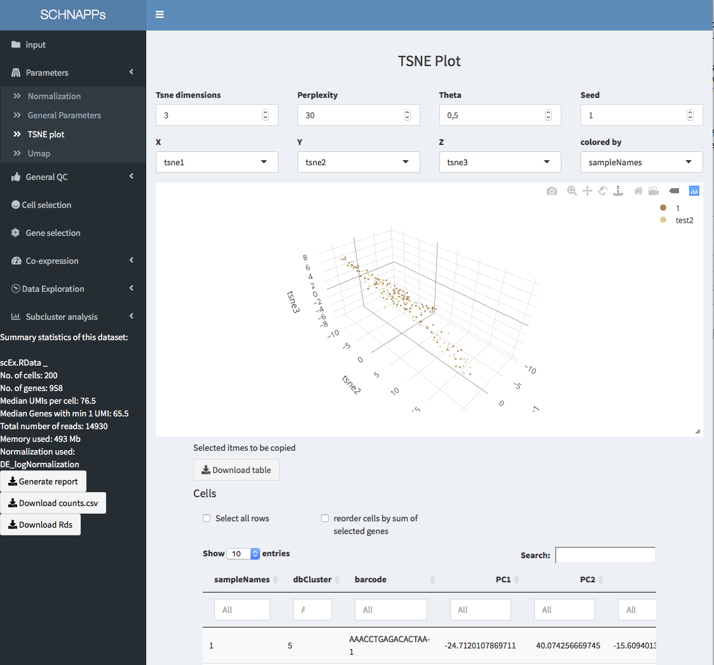
```

Place to change the parameters for the tSNE calculations (Wrapper for the C++ implementation of Barnes-Hut t-Distributed Stochastic Neighbor Embedding. t-SNE is a method for constructing a low dimensional embedding of high-dimensional data, distances or similarities. Exact t-SNE can be computed by setting theta=0.0.) . Rtsne package is used. All PCA components available are used for the calculations. The number of PCs calculated is set under Parameters - General Parameters. 

The 3D display is not limited to the tsne projections and can be used in addition to the Co-expression -s Seleccted 2D plot. Special projections like histogram are not available.

* Tsne dimensions

    The number of dimensions to be calculated for tSNE. Fixe to 3 currently.

* Perplexity 

    Perplexity parameter (should not be bigger than 3 * perplexity < nrow(X) - 1, see details Rtsne for further information) default = 30, min = 1, max = 100.
    
* Theta 

    Speed/accuracy trade-off (increase for less accuracy), set to 0.0 for exact TSNE (default: 0.5), min = 0.0, max = 1, step = 0.1.

* Seed

    Seed for random data generator to be used. Default =1, min = 1, max = 10000.

* X

    Dimension for the X axis.
* Y

    Dimension for the Y axis.

* Z

    Dimension for the Z axis.
    
* Colored by

    Dimension for the color to be used.

* Table

    Table of all projections

### Umap

```{r, out.width='90%', fig.align='center', fig.cap='Parameters - UMAP', echo=FALSE}
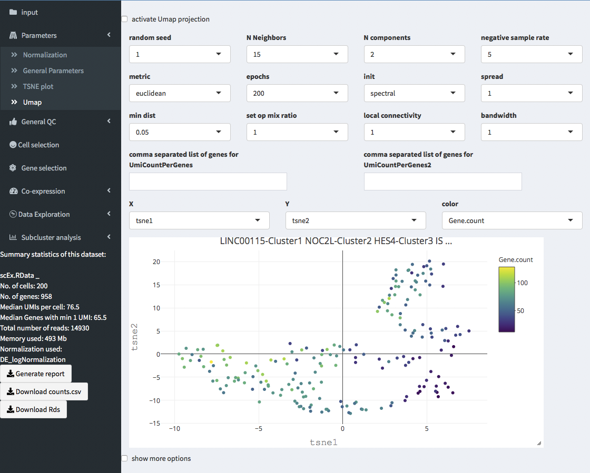
```

Calculation of Umap projections. Since this can be quite time consuming there is a checkbox called “activate Umap projection” that starts the computation. When this is selected all changes in the parameters result in new executions. Thus it should be unchecked while the parameters are changed. The R package uwot is used. The description of the parameters comes directly from the package documentation.

* random seed

    Seed for random data generator to be used. Default =1, min = 1, max = 100.

* N Neighbors

    The size of local neighborhood (in terms of number of neighboring sample points) used for manifold approximation. Larger values result in more global views of the manifold, while smaller values result in more local data being preserved. In general values should be in the range 2 to 100.

* N components

    The dimension of the space to embed into. This defaults to 2 to provide easy visualization, but can reasonably be set to any integer value in the range 2 to 100.

* negative sample rate

    The number of negative edge/1-simplex samples to use per positive edge/1-simplex sample in optimizing the low dimensional embedding.

* Metric 

    Type of distance metric to use to find nearest neighbors. Possible values: "euclidean", "manhattan", "cosine", "hamming"

* Epochs

    Number of epochs to use during the optimization of the embedded coordinates. By default, this value is set to 500 for datasets containing 10,000 vertices or less, and 200 otherwise.

* Init 

    Type of initialization for the coordinates. Possible values: "spectral", "random".

* Spread

    The effective scale of embedded points. In combination with min_dist, this determines how clustered/clumped the embedded points are.

* min dist

    The effective minimum distance between embedded points. Smaller values will result in a more clustered/clumped embedding where nearby points on the manifold are drawn closer together, while larger values will result on a more even dispersal of points. The value should be set relative to the spread value, which determines the scale at which embedded points will be spread out.

* Set op mix ratio

    Interpolate between (fuzzy) union and intersection as the set operation used to combine local fuzzy simplicial sets to obtain a global fuzzy simplicial sets. Both fuzzy set operations use the product t-norm. The value of this parameter should be between 0.0 and 1.0; a value of 1.0 will use a pure fuzzy union, while 0.0 will use a pure fuzzy intersection.

* local connectivity

    The local connectivity required – i.e. the number of nearest neighbors that should be assumed to be connected at a local level. The higher this value the more connected the manifold becomes locally. In practice this should be not more than the local intrinsic dimension of the manifold.

* Bandwidth

    The effective bandwidth of the kernel if we view the algorithm as similar to Laplacian Eigenmaps. Larger values induce more connectivity and a more global view of the data, smaller values concentrate more locally.

```{r, child='GeneralQC.cRmd'}
```


## Cell selection

```{r, out.width='90%', fig.align='center', fig.cap='Cell selection', echo=FALSE}
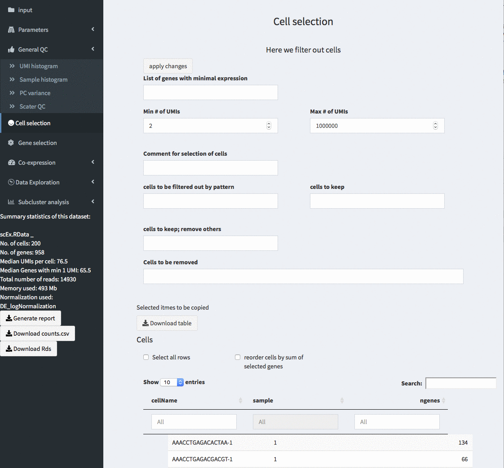
```

All selections are based on the original input data without filtering genes. In case this is needed, one can apply the gene filter, save the RData file and then apply the cell filters.

* List of genes with minimal expression

    Specify a comma separated list of genes that have to be expressed with at least one UMI. If you want to restrict to cells that express a gene to more than one UMI, you would have to select those cells manually using one of the 2D plots.

* Min # of UMIs / Max # of UMIs

    Select only cells that have at least / no more than X number of UMIs. 

* Comment for selection of cells

    The text entered here will be displayed in the report

* cells to be filtered out by pattern 

* cells to keep

* cells to keep; remove others

* Cells to be removed


* Cell table

    All cells are shown, even those that have been removed. The result of the removal can be verified in the stats section of the side-panel.

## Gene selection

```{r, out.width='90%', fig.align='center', fig.cap='', echo=FALSE}
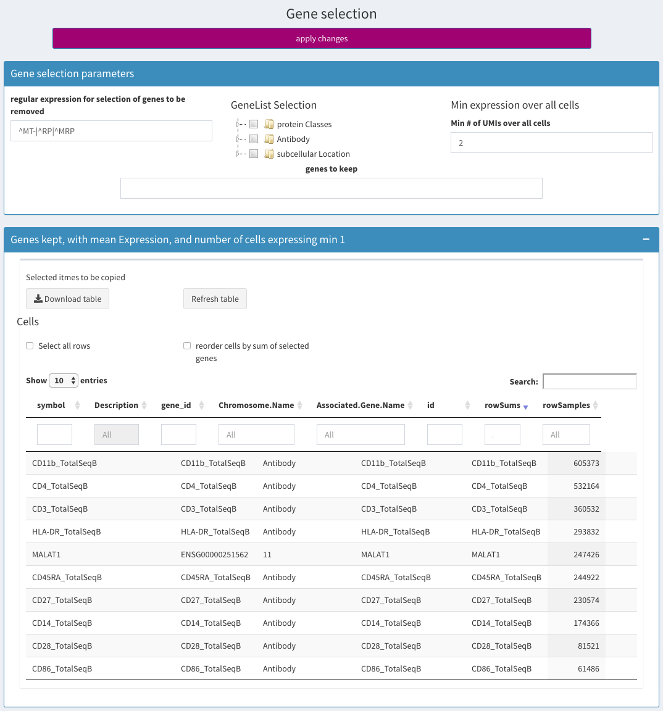
```
```{r, out.width='90%', fig.align='center', fig.cap='General QC - highest expressed genes', echo=FALSE}
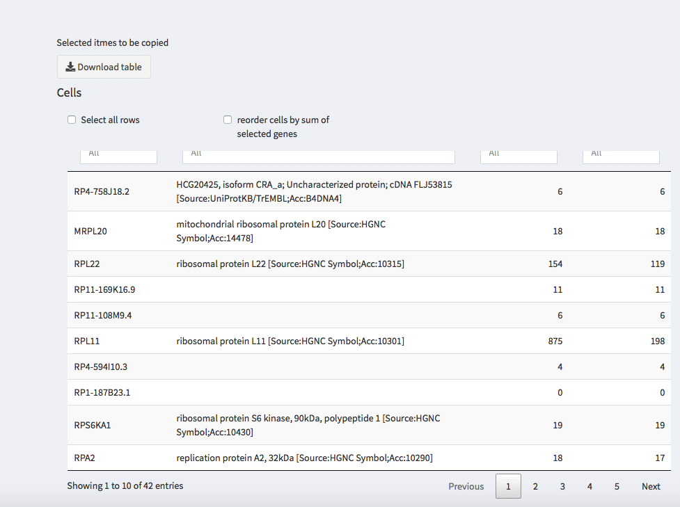
```

* regular expression for selection of genes to be removed

* GeneList Selection

    From this list sets of genes belonging to a specific class of proteins can be selected. This is only useful for human genes. Specific tables for other genomes could be made available upon request.

* Min expression over all cells

    This corresponds to the rowSums in the kept genes table and refers total number of UMIs for a given gene over all cells. 

* genes to keep

    Set the gene names that should be kept.

* Table Genes kept

    Holds the genes that are left after removal.
    The column rowSums holds the sum of UMIs for all cells
    The column rowSamples holds the number of cells where the gene is expressed

* Table Genes removed

    Shows the genes that were removed.

## Co-expression

### All clusters

```{r, out.width='90%', fig.align='center', fig.cap='Co-expression - All clusters', echo=FALSE}
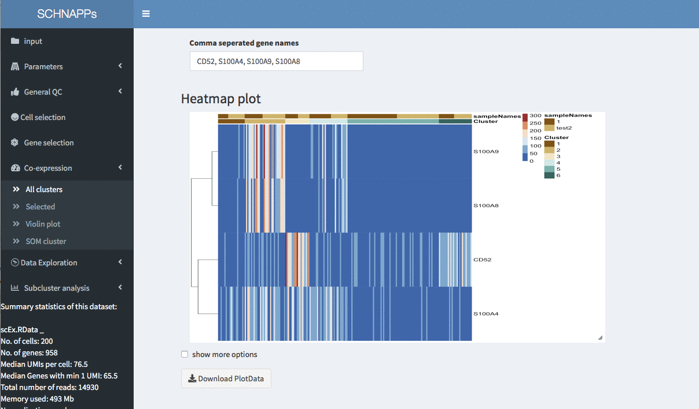
```

* Comma seperated gene names

    Comma separated list of genes to be displayed in the heatmap for all cells.

* Heatmap plot

    Uses the heatmap module see Modules Heatmap in this document

### Selected

```{r, out.width='90%', fig.align='center', fig.cap='Co-expression - Selected -- before selection', echo=FALSE}
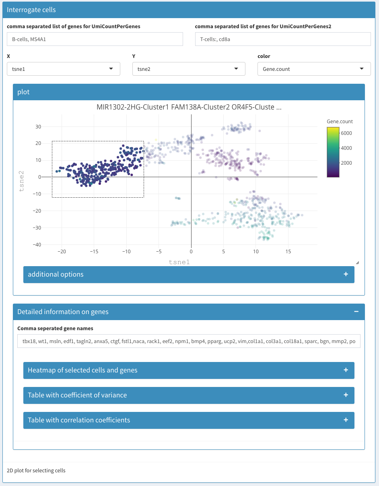
```

```{r, out.width='90%', fig.align='center', fig.cap='', echo=FALSE}
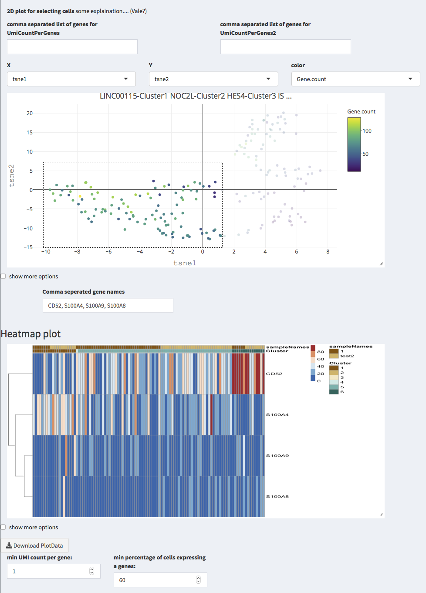
```
```{r, out.width='90%', fig.align='center', fig.cap='Co-expression - Selected', echo=FALSE}
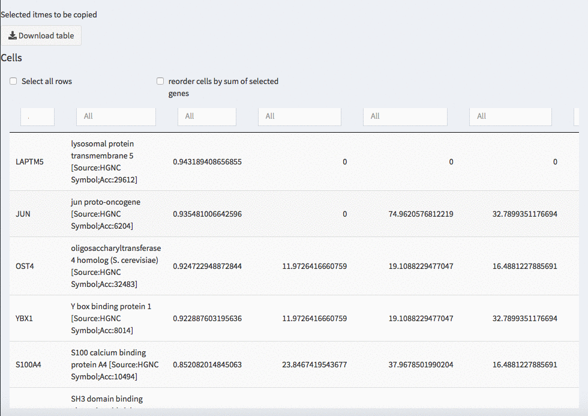
```

* 2D plot

    Uses a 2D plot module to display cells. Selected cells are being used in heatmap and table below.

* Heatmap

    Uses the selected cells from the above 2D Plot and displays a heat map.

* min UMI count per gene:

    For the table below, set the minimum number of UMIs for a given gene to be considered.

* min percentage of cells expressing a genes

    Genes in the table below have to be expressed in at least this percent of the cells

* Table of “co-expressing” genes

    Uses the Table module to display for the selected cells the genes that are expressed with a minimal UMI count (see above) in at least X % (see above) of the cells. This is yet another way to identify genes that are expressed over all the selected cells.

### Violin plot

```{r, out.width='90%', fig.align='center', fig.cap='Co-expression - Violin plot', echo=FALSE}
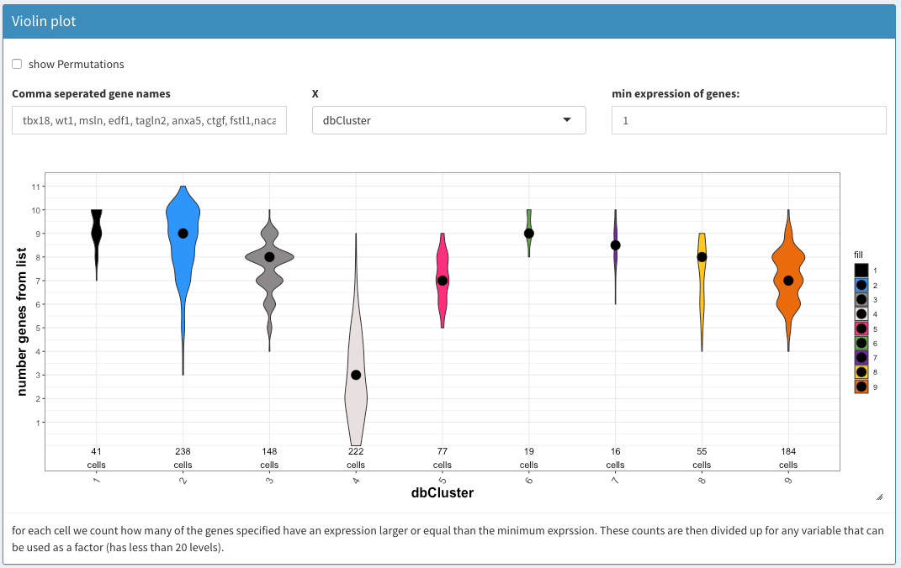
```

```{r, out.width='90%', fig.align='center', fig.cap='Co-expression - Violin plot with permutations', echo=FALSE}
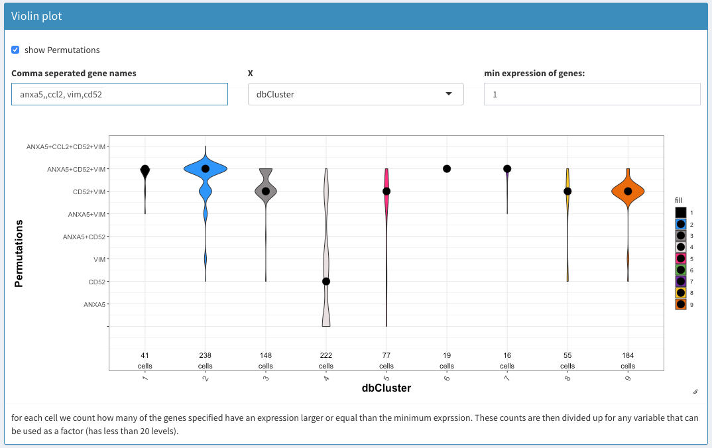
```


* show Permutations

    Selecting this can cause substantial calculations if the number of genes is large and make the display very ugly. On the othe hand, it will show which combination of genes are co-expressed to which extend.

* Comma seperated gene names

    A comma separated list of genes to investigate using the violin plot. If a gene doesn’t show it is not expressed in any of the cells.

* X

    X-axis to be used. Only factors (cell attributes with less than 21 unique values) are shown.

* min expression of genes

    Only genes with at least this number of UMIs are considered for the plot. This allows one to remove potential artefacts. Normalized counts are used.

* Violin plot

    Cannot be interogated. This gives just an overview. The cells coresponding to the individual values have to be selected using one of the 2D plot (preferably the Co-expression-selected)

### SOM cluster

```{r, out.width='90%', fig.align='center', fig.cap='Co-expression - SOM network too large', echo=FALSE}
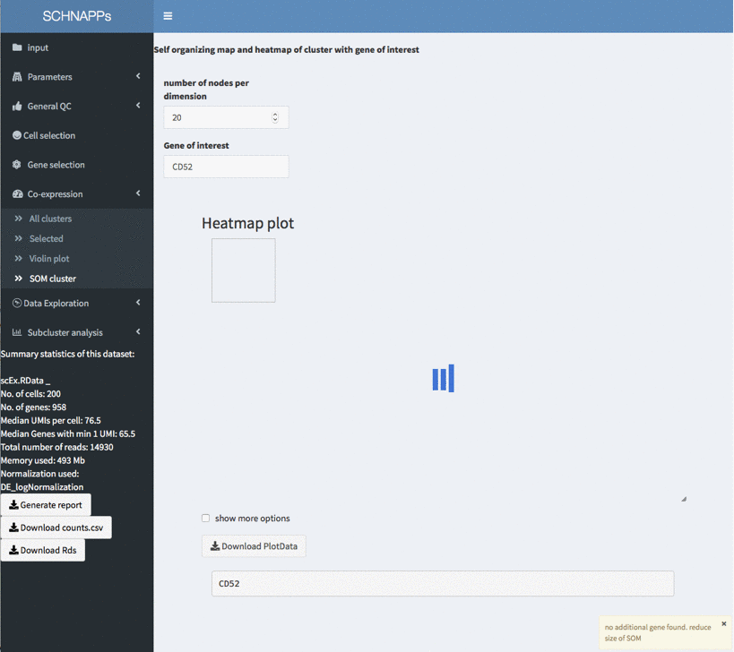
```

```{r, out.width='90%', fig.align='center', fig.cap='Co-expression - SOM', echo=FALSE}
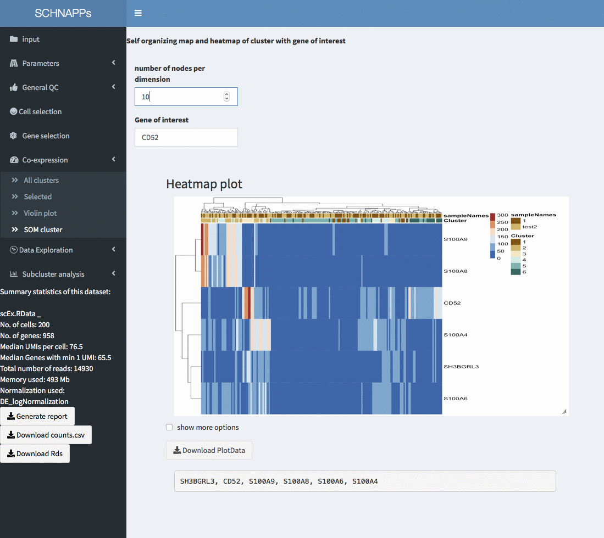
```

A self organizing map is calculated of all the cells. The matrix of normalized counts is used for the clustering. A square SOM with X nodes per dimension is calculated using     nEpoch = 10, radius0 = 0, radiusN = 0, radiusCooling = "linear", mapType = "planar", gridType = "rectangular", scale0 = 1, scaleN = 0.01, scaleCooling = "linear" as parameters in the Rsomoclu.train function of the Rsomoclu package. globalBmus is used to identify genes that cluster together. The cluster(s) that contain the gene(s) of interest are returned.

* number of nodes per dimension

* Gene of interest

* Heatmap 

    A heat map of the identied genes is displayed. Cluster are not the SOM cluster (since all the genes are from the same cluster).

* Identified gene list

    For better copy/paste operations the list of genes is displayed as a comma separated list.

## Data Exploration

### Expression

```{r, out.width='90%', fig.align='center', fig.cap='Data exploration - Expression', echo=FALSE}
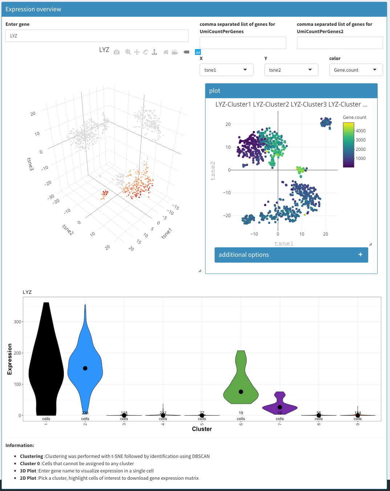
```

As a convenience the following three plots are combined in one view. Most of the functionality displayed here can also be achieved using other tabs/views.

* Enter gene

    Gene name or comma separated list of genes whoes expression level is being used to color cells in the 3D plot and violin plot.

* 3D plot

    tSNE plot of the first 3 tSNE projections is shown, colored by the expression of the genes of interest.

* 2D plot

    Standard 2D plot. Selections have no influence anywhere.

* Violin plot

    Whereas the violin plot under Co-expression-Violin shows the number of cells the express (or not) a given gene, here, the expression is estimated. The x-axis is fixed to clusters.

### Panel plot

```{r, out.width='90%', fig.align='center', fig.cap='Data exploration - Panel plot', echo=FALSE}
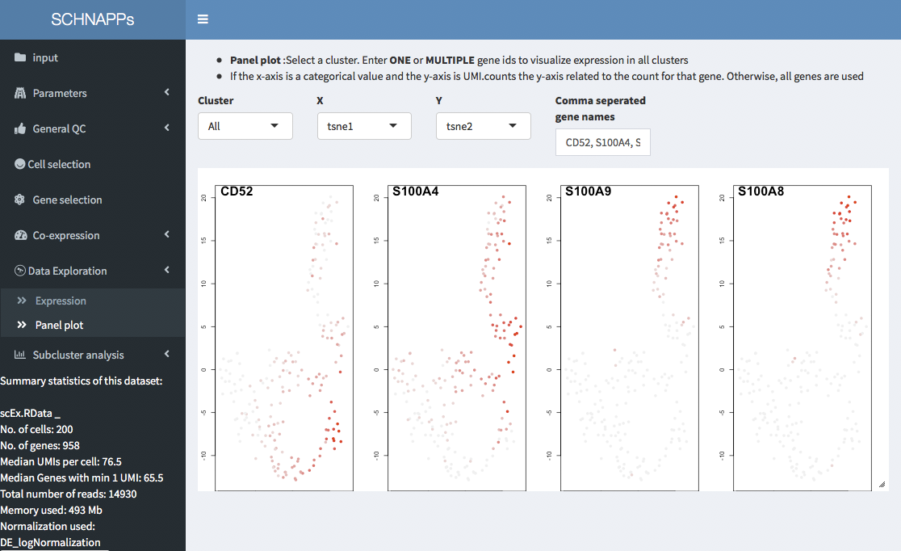
```

2D plots of genes of interest. If the x-axis is a categorical value and the y-axis is UMI.counts the y-axis related to the count for that gene. Otherwise, all genes are used. This plots automatically creates box plots if the x-axis is a categorical value. If a categorical value is chosen for the y-axis an error message is displayed (‘min’ not meaningful for factors). Choosing barcodes as an axis can cause the computer to hang. When y-axis is set to UMI.counts the most useful values for the x-axis are sampleNames or dbCluster, which allows comparing the expression of different genes in parallel over different samples or clusters.

* Cluster

    Choose either all clusters combined (All) or an individual cluster

* X

    Projection to be used for the x-axis.

* Y

    Projection to be used for the y-axis.

* Comma separated gene names

    List of genes for which a 2D plot should be gerenated.

* Plots

## Subcluster analysis

### DGE analysis

```{r, out.width='90%', fig.align='center', fig.cap='Subcluster analysis - DGE analysis before selection', echo=FALSE}
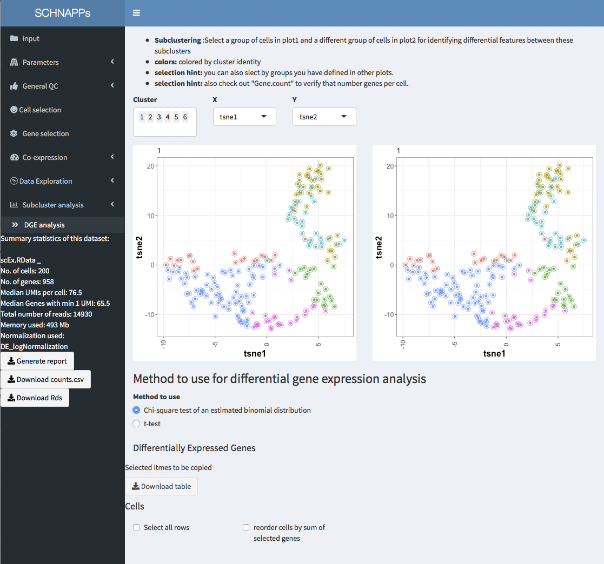
```

```{r, out.width='90%', fig.align='center', fig.cap='Subcluster analysis - DGE analysis', echo=FALSE}
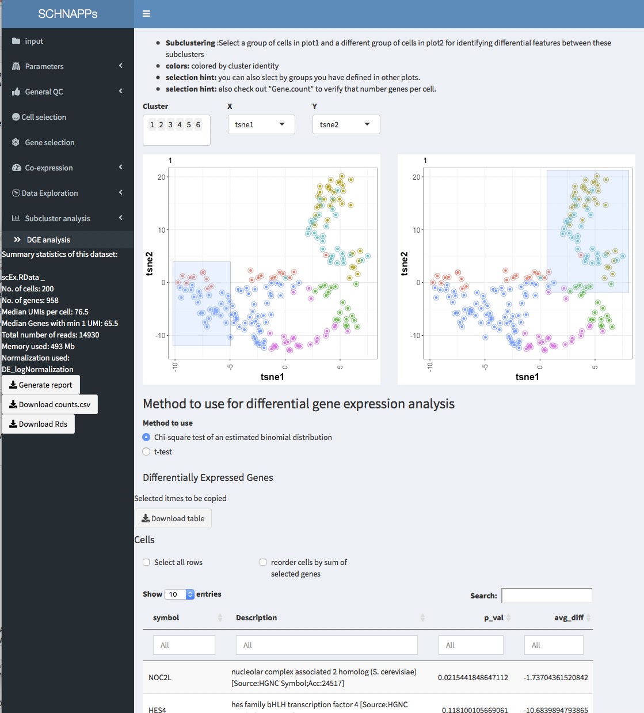
```

Differential gene expression analysis of selected genes.

* Cluster

    Selection of clusters to be used/displayed

* X

    X coordinate for both plots

* Y

    Y coordinate for both plots

* Plot 1

    Plot for the selection of case samples

* Plot 2

    Plot for the selection of control samples

* Method to use

    * Chi-square test

        A chi-square test is performed on an estimated binomial distribution. This is one of the only remaining parts from the original CellView app that was used to help get started with this application.

    * t-test

        Standard t-test from the R-stats package is used to calculate the p-values.

* Table: differentially expressed genes

    Table with the differentially expressed genes.
    If a gene is higher expressed control samples (right plot) the average difference will be negative.

# Reused GUI elements (Modules)

## Tables

```{r, out.width='90%', fig.align='center', fig.cap='Modular tables', echo=FALSE}
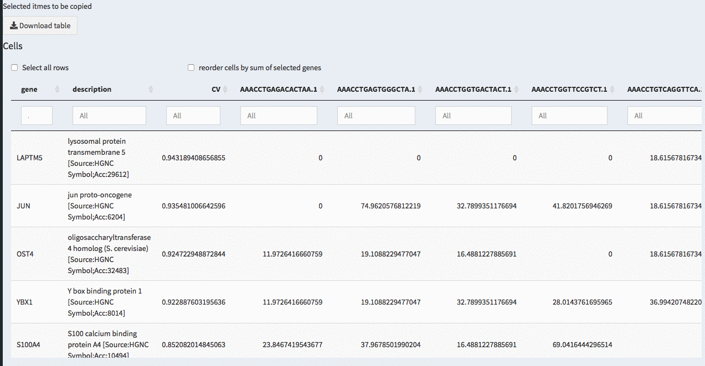
```

```{r, out.width='90%', fig.align='center', fig.cap='Modular tables - two rows selected', echo=FALSE}
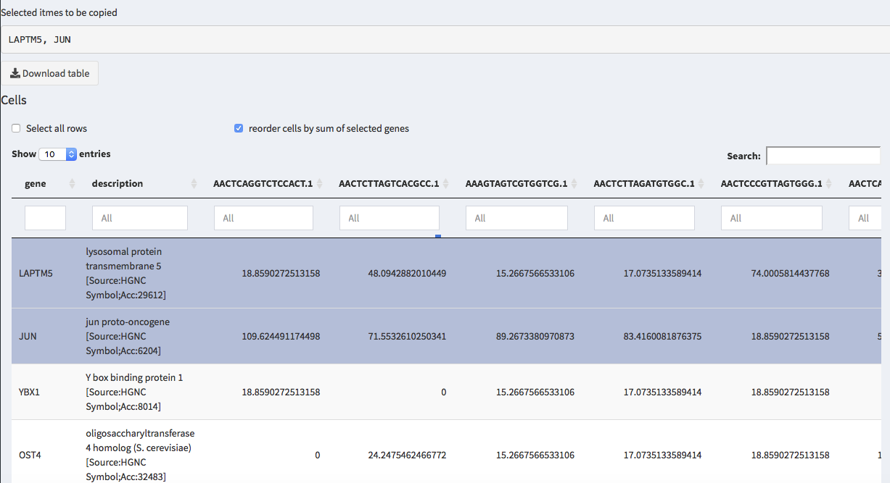
```

```{r, out.width='90%', fig.align='center', fig.cap='Modular tables - reorder', echo=FALSE}
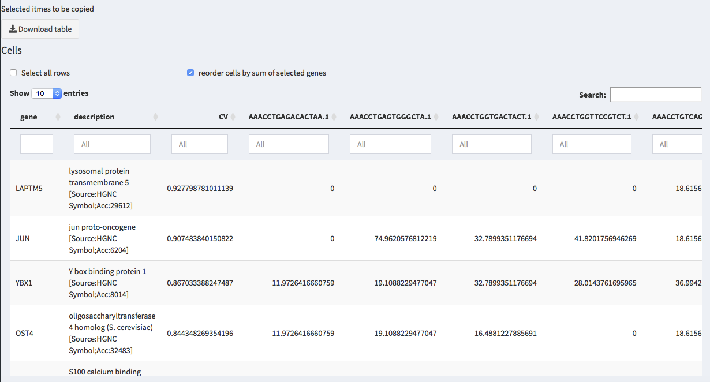
```

```{r, out.width='90%', fig.align='center', fig.cap='Modular tables - all selected', echo=FALSE}
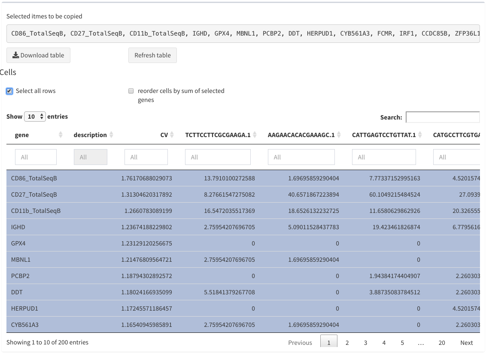
```

A modular table can be downloaded using the “Download Table” button. 

* Selected names to be copied

    When selecting row the corresponding row names are displayed as a comma separated list. This is useful for copy/paste actions in different other views.

* Select all rows

    Can be used to select all rows of the table and display the row names, but also through repetetive selection/unselection the selection can be removed.

* reorder cells by sum of selected genes

    Only the first 20 columns are shown. Since it is not necessarily clear that the first columns are the most interesting the user has the option to select genes and the reorder the columns based on the sum of these genes per cell. This happens when this option is checked.
    This option is not always applicable (e.g. DGE analysis)

* Table

    The table itself can be sorted (rows) by clicking on the column header. The sort order is indicated with a small triangle. Columns can also be filtered and a full text search is possible. The number of displayed rows can be changed as well.

## 2D plots

```{r, out.width='90%', fig.align='center', fig.cap='Modular 2D plots', echo=FALSE}
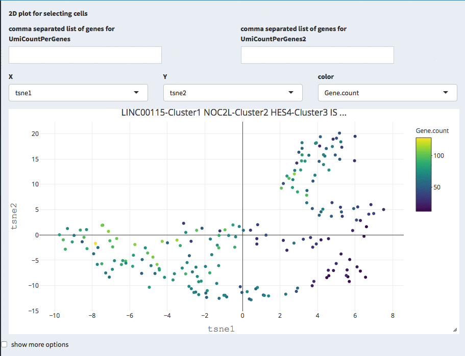
```

```{r, out.width='90%', fig.align='center', fig.cap='Modular 2D plots', echo=FALSE}
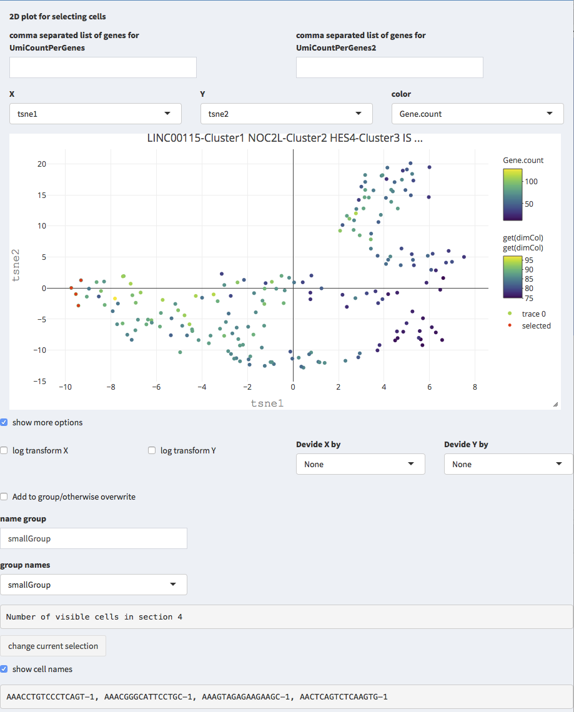
```

```{r, out.width='90%', fig.align='center', fig.cap='Modular 2D plots - additional options', echo=FALSE}
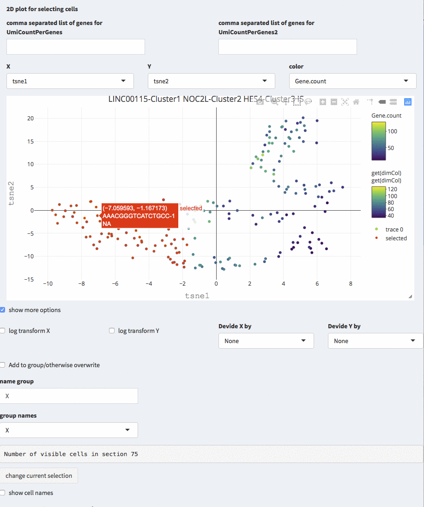
```

Except for the Co-expression - Selected tab the selection of cells is not used.

* comma separated list of genes for UmiCountPerGenes (left / right)

    A list of comma separated gene names. In the columns below the sum of the expression per cell is used. Using these two fields one can plot the summed expression of two groups of gene (or individual genes) to visualize the cells that co-express these genes.

* X, Y, color

    The fields allow the selection of the X and Y coordinate as well as selection of the color used for the cells.

* 2D plot

    When hovering over the right top of the figure a collection of options for saving the plot, changing the selection style and others will be made visible.
Zooming is possible in different ways (mouse, top right menu)

 * Show more options

    Upon selection other parameters are made visible.

    * Log transform X
    
    * Log transform Y

        Whether or not to show the data in log scale. Log with base 10 is used.
        
    
    * Divide X by
    
    * Divide Y by

        Divide the values of the X/Y axis with the values from this projection. This is useful for identifying dead cells, when using the “before.filter” projection or setting the UMICountsPerGene to ribosomal proteins (as a comma separated list)
    
    * Add to group/otherwise overwrite

        When checked, clicking the “change current selection” button will add the selected cells from the plot to the named group
    
    * Name group

        Here the name of a group can be changed. This will generate a new group. It is not possible to remove a group.
    
    * Group names

        A drop box selection for a group. This will also change the selection in the plot. This allows one to visualize a previously defined group of cells. Unfortunately it is not possible 
    
    * Number of visible cells in section

        Indicates the number of cells in a given group
    
    * Change current selection

        Using this button one writes the changes to memory

Comments on groups:

Handling the groups is relatively complex because of the different possibilities especially with selection process within the plot. Once the group is activated (either after selecting a group in the group names dropdown or by clicking on “change current selection” the selected cells are colored red (instead of highlighted when selecting using the box/lasso select). This selection overwrites the selection in the plot. To deactivate this behaviour one has to uncheck the “show more options” check-box. Unfortunately the selection box/highlighting is removed in the plot though the selection is still used in the corresponding visualizations. This can be confusing.

## Heatmaps

```{r, out.width='90%', fig.align='center', fig.cap='Modular heatmaps', echo=FALSE}
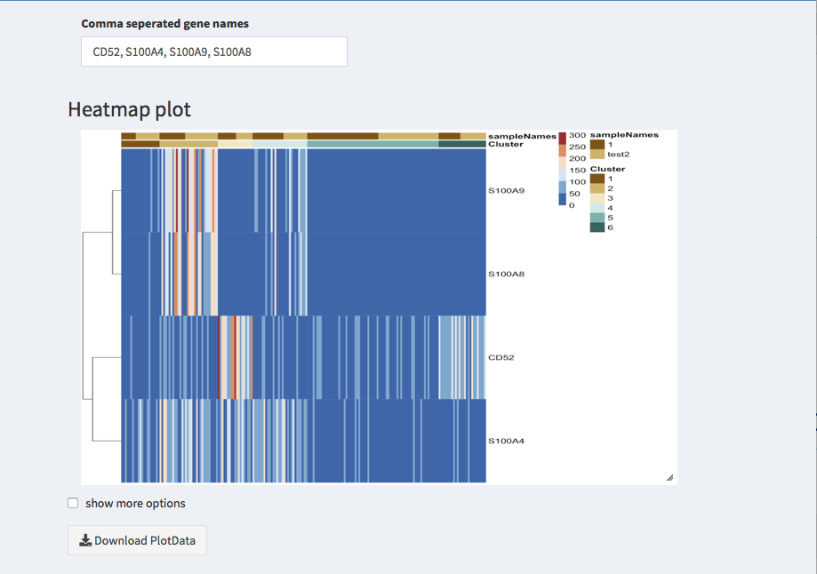
```

```{r, out.width='90%', fig.align='center', fig.cap='Modular heatmaps - order cells', echo=FALSE}
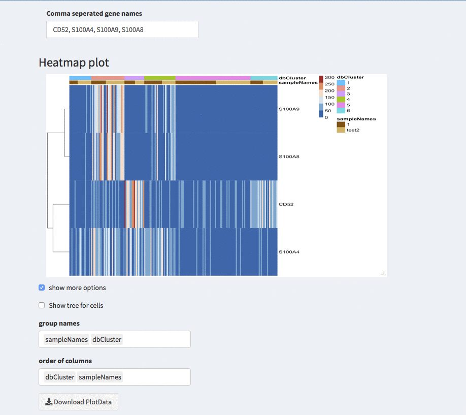
```

```{r, out.width='90%', fig.align='center', fig.cap='Modular heatmaps -  dendrogram', echo=FALSE}
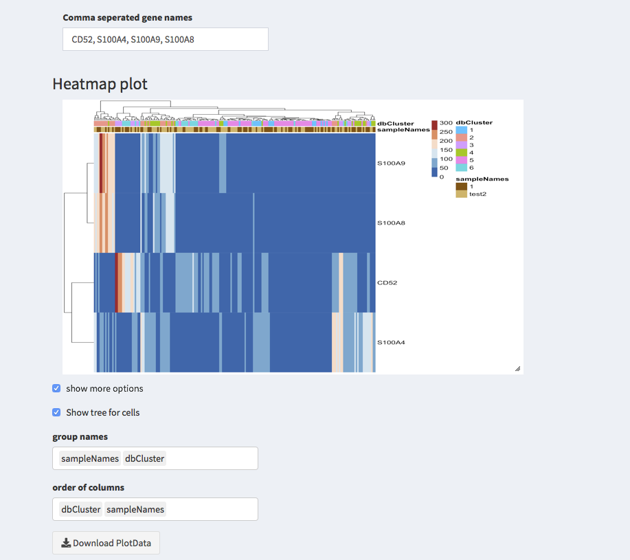
```

Like most figures the heatmap is also resizable using the lower right corner that can be dragged.

The color of the samples and clusters can be changed under Parameters - general parameters. 

* Show more options

    Once selected additional options for sorting and displaying annotion appear. 

    * Show tree for cells

        The check-box overwrites the order (if any) that is described below. The columns are odered corresponding to the hirachical clustering on the cells.

    * Group names

        Here, different projections can be chosen that appear as column annotations

    * Order of columns

        The columns can be ordered manually by any of the projections available.


# Create input data


```
BiocManager::install("SingleR")

```

# Notes

