```{r, echo=FALSE, results="hide", message=FALSE}
require(knitr)
library("htmltools")
library("vembedr")
opts_chunk$set(error=FALSE, message=FALSE, warning=FALSE)
```

# Introduction

Please see the Seurat workflow for a more indepth workflow.

https://satijalab.org/seurat/v3.1/pbmc3k_tutorial.html

This workflow uses a dataset of Peripheral Blood Mononuclear Cells (PBMC) freely available from 10X Genomics. There are 2,700 single cells that were sequenced on the Illumina NextSeq 500.


```{r}
library(plyr); library(dplyr)
library(Seurat)
library(patchwork)
library(SCHNAPPs)
library(SingleCellExperiment)
# Load the pbm dataset
pbm.data <- Read10X(data.dir = "~/Downloads/filtered_gene_bc_matrices/hg19/")
# Initialize the Seurat object with the raw (non-normalized data).
pbm <- CreateSeuratObject(counts = pbm.data, project = "pbm3k", min.cells = 3, min.features = 200)

pbm[["percent.mt"]] <- PercentageFeatureSet(pbm, pattern = "^MT-")

## in case of human samples:
# pbm <- CellCycleScoring(
# pbm,
#   g2m.features = cc.genes$g2m.genes,
#   s.features = cc.genes$s.genes
# )


scEx = as.SingleCellExperiment(pbm)

colnames(colData(scEx)) = c("sampleNames",   "nCount_RNA",   "nFeature_RNA", "percent.mt" , "ident"       )
colData(scEx)$barcode = rownames(colData(scEx))

rowData(scEx)$Description = ""
rowData(scEx)$id = rownames(rowData(scEx))
rowData(scEx)$symbol = rownames(rowData(scEx))

pbm

```

```{r seuratCont}

pbm <- subset(pbm, subset = nFeature_RNA > 200 & nFeature_RNA < 2500 & percent.mt < 5)
pbm <- pbm[-which(rowSums(pbm)==0),]
pbm <- NormalizeData(pbm)

pbm <-FindVariableFeatures(pbm, selection.method = "vst", nfeatures = 2000)

top10 <- head(VariableFeatures(pbm), 10)
all.VariableFeatures = VariableFeatures(pbm)
all.genes <- rownames(pbm)
# Why do they scale on all features???
set.seed(1)
pbm <- ScaleData(pbm, features = all.VariableFeatures)

pbm <- RunPCA(pbm, features = all.VariableFeatures, rank = 50)
scranPCA = BiocSingular::runPCA(t(as.matrix((Seurat::Assays(pbm,slot = "RNA")@scale.data))[all.VariableFeatures,]) , rank = 50)

pbm <- FindNeighbors(pbm, dims = 1:10)
pbm <- FindClusters(pbm, resolution = 0.5, verbose = FALSE)

pbm <- RunUMAP(pbm, dims = 1:10, verbose = FALSE)

colData(scEx)$seurartCluster = -1
colData(scEx)[names(Idents(pbm)),"seurartCluster"] = Idents(pbm)
colData(scEx)$seurartCluster = as.factor(colData(scEx)$seurartCluster)

```

## comparing BiocSingular and Seurat PCA calculations:

* Seurat
`r DT::datatable(Embeddings(pbm)[1:3,1:3])`


* BiocSingular
`r DT::datatable(scranPCA$x[1:3,1:3])`


```{r}
pbm
# Assays(pbm)

```

We have now created a SingleCellExperiment object with all information from Seurat. We will now try to recreate these results with SCHNAPPs:

We have to save the object in a file that can be opened with the "load" command.

```{r save file,  cache=TRUE, eval=FALSE}
save(file = "seurat.pbm.RData", list = c("scEx"))
```

To reproduce the results the following parameters have to be set in SCHNAPPs:

* Cell selection:
** Min # of UMIs = 1


```{r, out.width='70%', fig.align='center', fig.cap='Cell selection parameters', echo=FALSE}
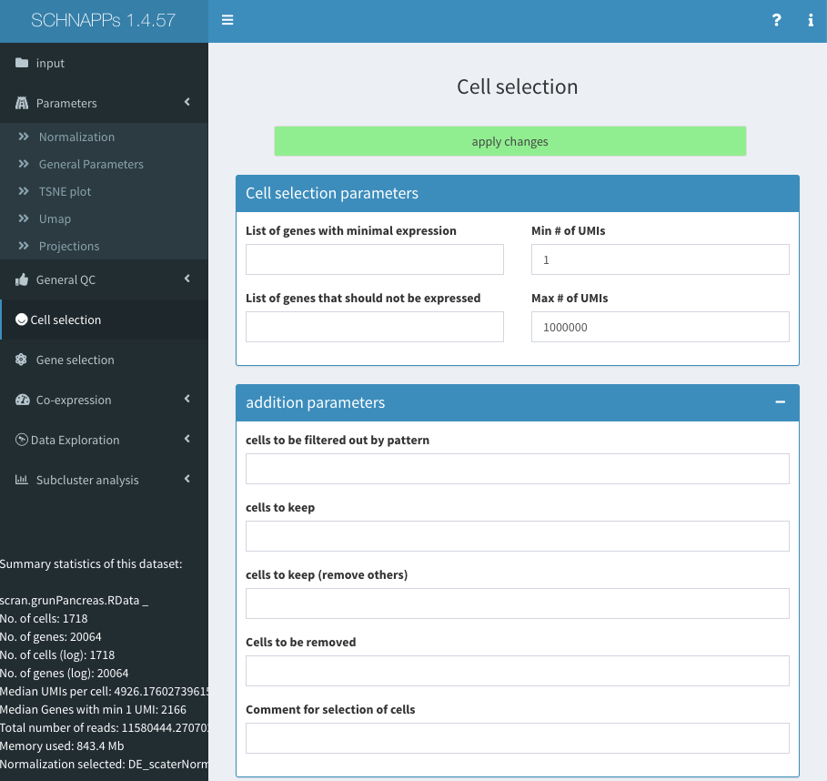
```

Just to be complete (we will do this later)
here is the list of cells that has to be removed:

AAAGATCTGGGCAA-1, AAAGCAGAAGCCAT-1, AACGCCCTGCTTAG-1, AAGGTCTGGTATGC-1, AATGTAACGTTTGG-1, AATTACGAGTAGCT-1, ACACAGACACCTGA-1, ACATGGTGCGTTGA-1, ACCTGGCTGTCTTT-1, ACTTAAGACCACAA-1, ACTTGTACCCGAAT-1, ACTTTGTGCGATAC-1, AGAGGTCTACAGCT-1, ATCACGGATTGCTT-1, ATTACCTGGGCATT-1, CACGCTACTTGACG-1, CAGTGTGAACACGT-1, CCAATGGAACAGCT-1, CCAGTCTGCGGAGA-1, CGACCTTGGCAAGG-1, CGAGCCGACGACAT-1, CGGAATTGCACTAG-1, CGTAACGAATCAGC-1, CGTACCACGCTACA-1, CGTACCTGGACGAG-1, CTAGTTTGAGTACC-1, CTCAGCTGTTTCTG-1, CTCATTGATTGCTT-1, CTGGCACTGGACAG-1, CTTAACACGAGCTT-1, CTTAAGCTTCCTCG-1, GAAAGATGTTTGCT-1, GAACGTTGACGGAG-1, GAATGGCTAAGATG-1, GACCATGACTCTCG-1, GACTGAACAACCGT-1, GCCACTACCTACTT-1, GCGAAGGAGAGCTT-1, GCTACAGATCTTAC-1, GGCACGTGTGAGAA-1, GTCAACGATCAGGT-1, GTGAACACAGATCC-1, GTGTCAGAATGCTG-1, GTTAAAACTTCGCC-1, TAAGATACCCACAA-1, TACGCAGACGTCTC-1, TACGCGCTCTTCTA-1, TACGGCCTGTCCTC-1, TATCACTGACTGTG-1, TCCCGATGCTGTGA-1, TCGCACACCATCAG-1, TCGTGAGAACTGTG-1, TGAAGCTGAGACTC-1, TGAGACACTGTGCA-1, TGAGCTGAGCGAGA-1, TGGAGACTGAAACA-1, TGGATGTGATGTCG-1, TGGCAATGGAGGGT-1, TGGTCAGACCGTTC-1, TGTTAAGATTGGCA-1, TTACTCGAACGTTG-1, TTCAAGCTTCCAAG-1


```{r, out.width='70%', fig.align='center', fig.cap='Cell selection additional parameters', echo=FALSE}
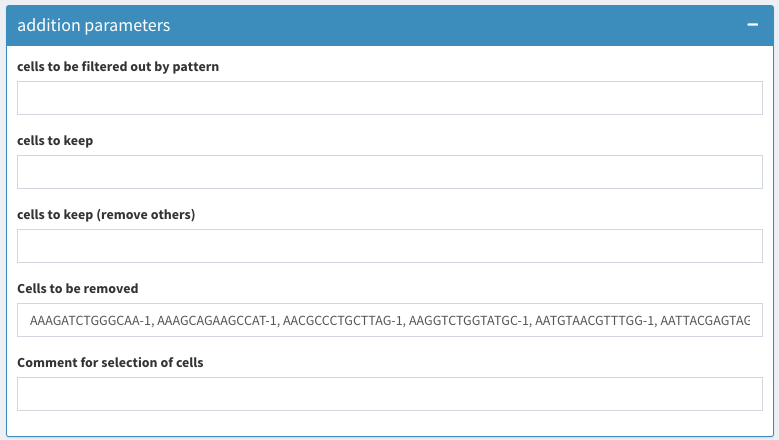
```


* Gene selection
** remove regular expression
** set min expression to 1

```{r, out.width='70%', fig.align='center', fig.cap='Gene selection parameters', echo=FALSE}
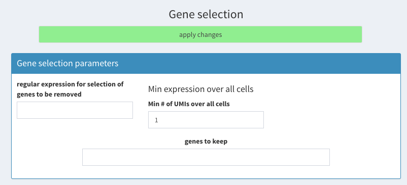
```

* Parameters - Normalization

** Select SeuratLogNorm, the standard Normalization function in Seurat.

```{r, out.width='70%', fig.align='center', fig.cap='Select normalization method', echo=FALSE}
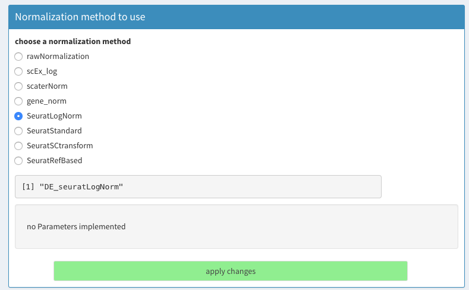
```

* Parameters - General Parameters

* PCA parameters

** center = true
** scate = true
** use Seurat::RunPCA = ture
** Number of variable genes to be used = 2000
** select highly expressed using "vst"

* Clustering parameters
** Seurat clustering tab.
** Dimensions from PCA to use: 10
** k = 20

```{r, out.width='70%', fig.align='center', fig.cap='General parameters for PCA and clustering', echo=FALSE}
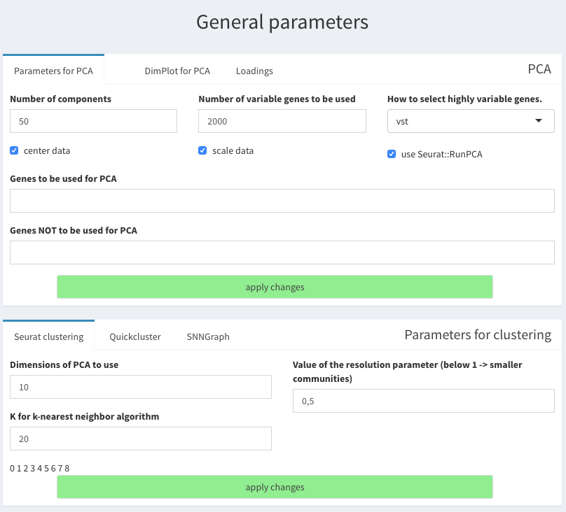
```

* load input  file

** unset sub sampling of data
** check "calculate normalization here"

```{r, out.width='70%', fig.align='center', fig.cap='Load data - parameters', echo=FALSE}
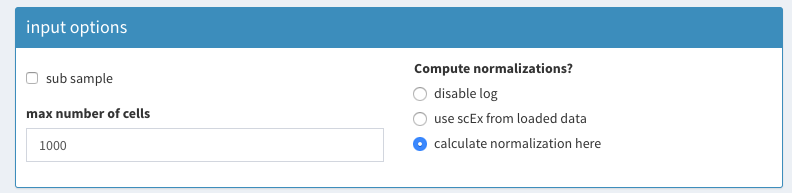
```


```{r, out.width='70%', fig.align='center', fig.cap='Load data select file', echo=FALSE}
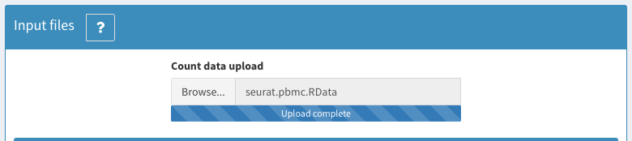
```

## Set color for sample

Just for estetics:

Under Parameters - General Parameters set a nicer color for the samples other than black (which isn't a color anyways.)

```{r, out.width='70%', fig.align='center', fig.cap='Set color for samples', echo=FALSE}
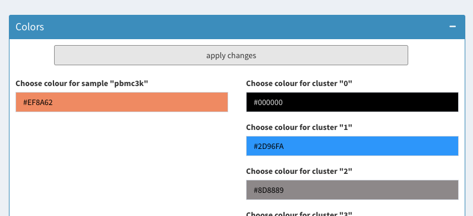
```


## select cells to be removed

Using the 2D plot the cells with more than 2500 nFeature_RNA and more than 5 percent.mt can be selected and removed from the data set:

We have to comply to three thresholds that are being used:

* nFeature_RNA > 200 
* nFeature_RNA < 2500 
* percent.mt   < 5

Go to Co-expression - selected:

set the following options:

* X : nFeature_RNA
* Y : percent.mt
* color: sampleNames

```{r, out.width='70%', fig.align='center', fig.cap='2D plot, select cells to be removed 1', echo=FALSE}
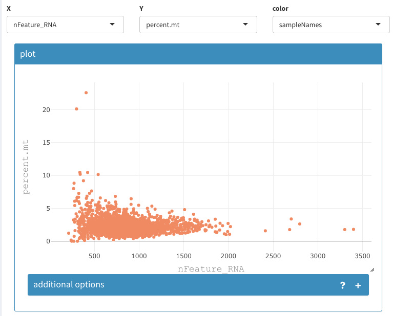
```

select the zoom function in the plot:

```{r, out.width='30%', fig.align='center', fig.cap='zooming selector', echo=FALSE}
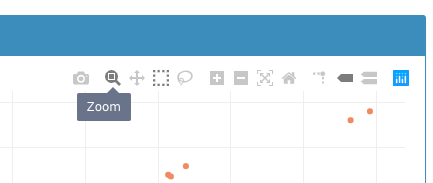
```

Zooming into the low nFeatureRNA region reveals that no cells will be removed using the 200 threshold.

```{r, out.width='70%', fig.align='center', fig.cap='Filter based on detected genes', echo=FALSE}
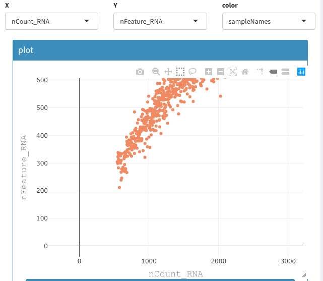
```

choose box select:

```{r, out.width='30%', fig.align='center', fig.cap='Selection tool (box)', echo=FALSE}

```


* Select the cells that are higher than 5 (roughly) percent.mt
* set the name of the group to "rmCells"
* group names has to be plot


```{r, out.width='70%', fig.align='center', fig.cap='2D plot, select cells to be removed 2', echo=FALSE}
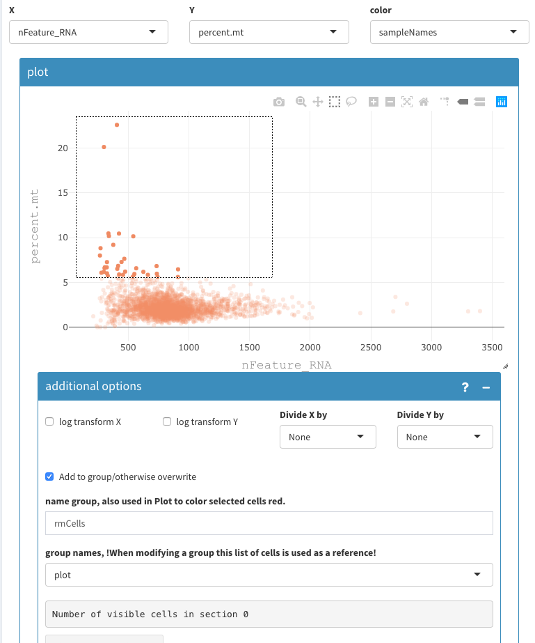
```

* click on current selection

=> the cells are now red

* set group names back to "plot"


change the zoom to be able to select anything around 5 percent.mt and show additional options:


```{r, out.width='70%', fig.align='center', fig.cap='2D plot, select cells to be removed 3', echo=FALSE}
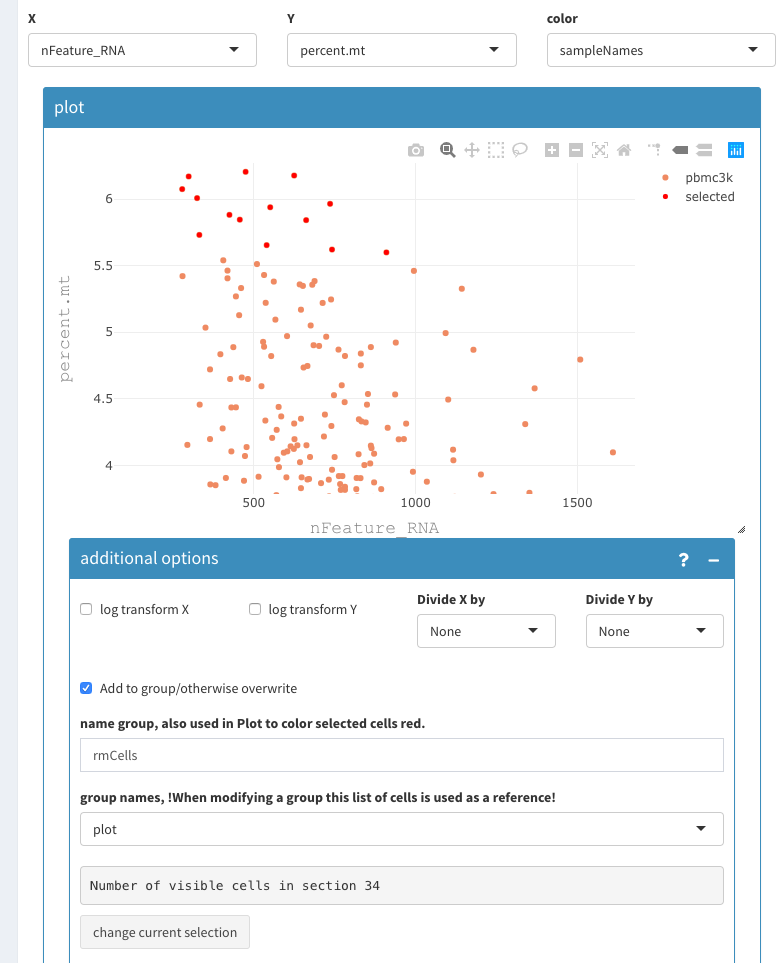
```

* select the remaining cells and add them to "rmCells" list.
* if you are not sure about a cell the values can be shown hovering over the points


```{r, out.width='70%', fig.align='center', fig.cap='2D plot, select cells to be removed 4', echo=FALSE}
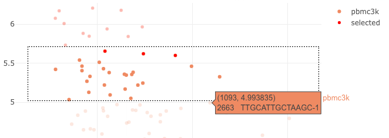
```

* proceed similarly to select the cells that have more than 2500 nFeature_RNA.

You should have 62 cells selected.

* check the "show cell names" check box.
* copy the cell names (tripple click on a cell name; Command-C)
* Paste the cell name under "Cells to be removed" (see above, cell selection)
* click "apply changes"

```{r, out.width='70%', fig.align='center', fig.cap='2D plot, select cells to be removed 4', echo=FALSE}
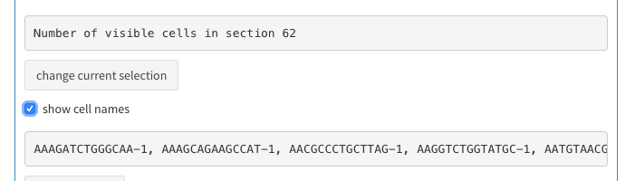
```

* summary Stats:

That is how summary stats should look like:


```{r, out.width='50%', fig.align='center', fig.cap='Summary statistics', echo=FALSE}
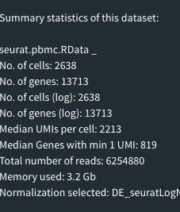
```

## Clustering comparison

We can now compare the clustering results:

Both graphs show the same thing: All cells have been assigned to the same cluster. (Just the numbering is different.)


```{r, out.width='90%', fig.align='center', fig.cap='Alluvial plot', echo=FALSE}
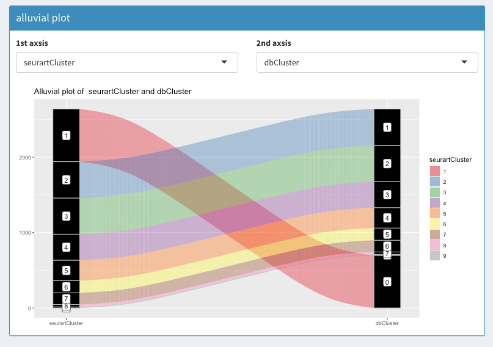
```


```{r, out.width='90%', fig.align='center', fig.cap='2D cluster comparison', echo=FALSE}
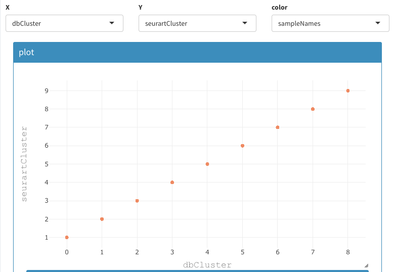
```


Q.E.D.
