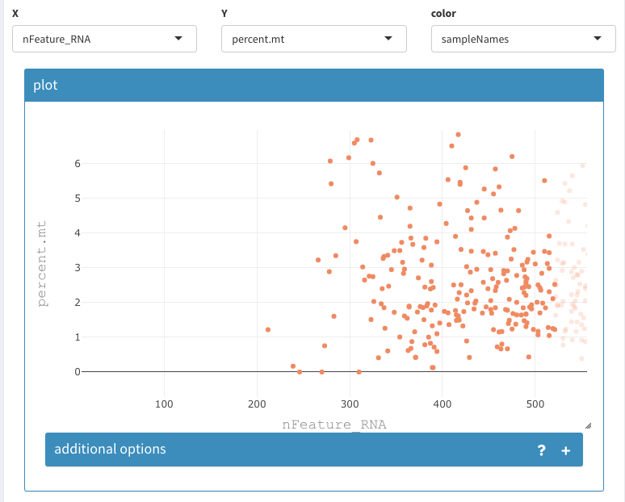

```{r, echo=FALSE, results="hide", message=FALSE}
require(knitr)
library("htmltools")
library("vembedr")
opts_chunk$set(error=FALSE, message=FALSE, warning=FALSE)
```

Please see the scran workflow for a more indepth workflow.

```{r}
library(dplyr)
library(Seurat)
library(patchwork)
library(SCHNAPPs)
library(SingleCellExperiment)
# Load the pbm dataset
pbm.data <- Read10X(data.dir = "~/Downloads/filtered_gene_bc_matrices/hg19/")
# Initialize the Seurat object with the raw (non-normalized data).
pbm <- CreateSeuratObject(counts = pbm.data, project = "pbm3k", min.cells = 3, min.features = 200)
pbm

pbm[["percent.mt"]] <- PercentageFeatureSet(pbm, pattern = "^MT-")

## in case of human samples:
# pbm <- CellCycleScoring(
# pbm,
#   g2m.features = cc.genes$g2m.genes,
#   s.features = cc.genes$s.genes
# )


scEx = as.SingleCellExperiment(pbm)

colnames(colData(scEx)) = c("sampleNames",   "nCount_RNA",   "nFeature_RNA", "percent.mt" , "ident"       )
colData(scEx)$barcode = rownames(colData(scEx))

rowData(scEx)$Description = ""
rowData(scEx)$id = rownames(rowData(scEx))
rowData(scEx)$symbol = rownames(rowData(scEx))

pbm
Assays(pbm)
```

```{r seuratCont}

pbm <- subset(pbm, subset = nFeature_RNA > 200 & nFeature_RNA < 2500 & percent.mt < 5)
pbm <- pbm[-which(rowSums(pbm)==0),]
pbm <- NormalizeData(pbm)

x <- assays(scEx_log)[["logcounts"]]
dim(x)
dim(Assays(pbm, "RNA")@data)
which(!rownames(x) %in% rownames(pbm))
rownames(pbm)[which(!rownames(pbm) %in% rownames(x))]


pbm <-FindVariableFeatures(pbm, selection.method = "vst", nfeatures = 2000)
  # head(VariableFeatures(FindVariableFeatures(pbm, selection.method = "vst", nfeatures = 2000)),10)
  # 
  # ttt = FindVariableFeatures(pbm, selection.method = "vst", nfeatures = 2000)
  # tt = FindVariableFeatures(Assays(pbm, slot = "RNA")@counts, selection.method = "vst", nfeatures = 2000)
  
  
top10 <- head(VariableFeatures(pbm), 10)
all.VariableFeatures = VariableFeatures(pbm)
all.genes <- rownames(pbm)
# Why do they scale on all features???
set.seed(1)
pbm <- ScaleData(pbm, features = all.VariableFeatures)

GetAssayData(pbm, slot = 'scale.data')[all.VariableFeatures[1:3],1:3]
x2 = ScaleData(as.matrix(Assays(pbm,"RNA")@data), features = all.VariableFeatures)
x[1:3,1:3]
x2[1:3,1:3]

pbm <- RunPCA(pbm, features = all.VariableFeatures, rank = 50)
tt = RunPCA(as.matrix((Assays(pbm,"RNA")@scale.data))[all.VariableFeatures,] , rank = 50)
ttt = runPCA(t(as.matrix((Assays(pbm,"RNA")@scale.data))[all.VariableFeatures,]) , rank = 50)
Embeddings(pbm)[1:3,1:3]
Embeddings(tt)[1:3,1:3]
ttt$x[1:3,1:3]

pbm <- FindNeighbors(pbm, dims = 1:10)
pbm <- FindClusters(pbm, resolution = 0.5)

pbm <- RunUMAP(pbm, dims = 1:10)

colData(scEx)$seurartCluster = -1
colData(scEx)[names(Idents(pbm)),"seurartCluster"] = Idents(pbm)
colData(scEx)$seurartCluster = as.factor(colData(scEx)$seurartCluster)
nrow(Loadings(pbm))
```

```{r}
pbm
Assays(pbm)

```


```{r save file,  cache=TRUE, eval=FALSE}
save(file = "seurat.pbm.RData", list = c("scEx"))
```


Using the 2D plot the cells with more than 2500 nFeature_RNA and more than 5 percent.mt can be selected and removed from the data set:


Zooming into the low nFeatureRNA region reveals that no cells will be removed using the 200 threshold.

```{r, out.width='90%', fig.align='center', fig.cap='Filter based on detected genes', echo=FALSE}

```


